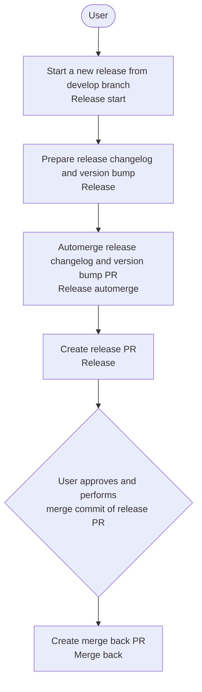
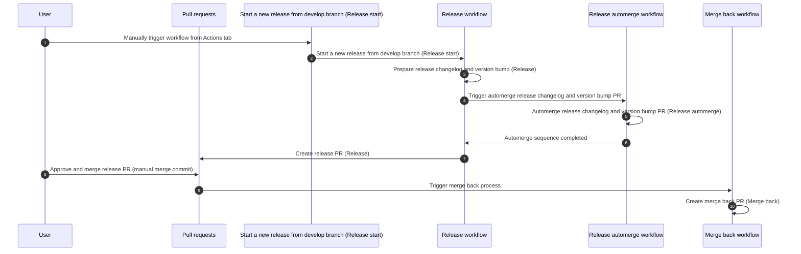
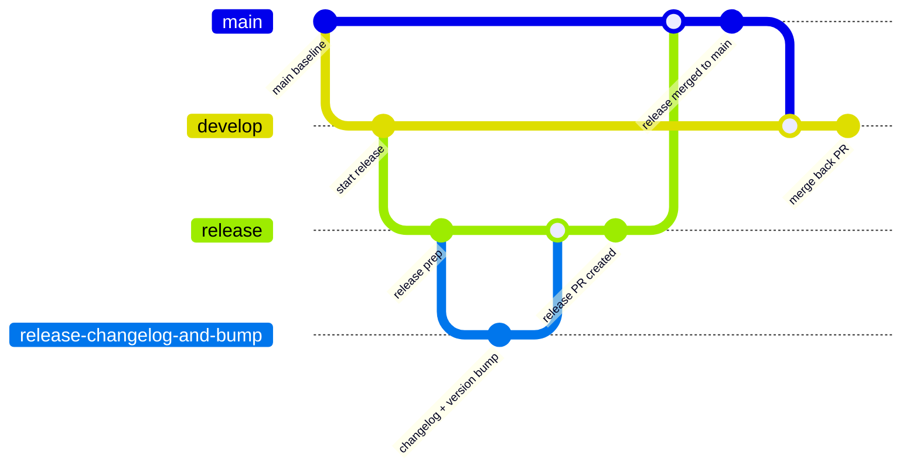

# github-action-test-backend

## Release Workflow

This document describes the automated release workflow starting from the GitHub Actions workflow Start a new release from develop branch (Release start).

Notes:

- CI-related steps named `Fake CI` are ignored in this flow.
- The release process is manually triggered by a user.
- A manual approval + merge commit is required for the release PR after it is created and after the release automerge workflow.

### Overview Diagram

### Sequence Diagram

### Branch Flow Diagram

## Step-by-Step Release Process

1. **Start a new release from develop branch** (`Release start`)
   - Entry point of the release process, manually triggered by a user from the GitHub Actions tab.
   - Kicks off the main release workflow on top of `develop`.

2. **Prepare release changelog and version bump** (`Release`)
   - Automatically computes the next version and prepares changelog/version updates.
   - Produces the changes that will be proposed through a release PR.

3. **Automerge release changelog and version bump PR** (`Release automerge`)
   - Runs automatically after release preparation.
   - Ensures release metadata updates are fully integrated.

4. **Create release PR** (`Release`)
   - Automatically opens the release pull request containing changelog and version bump.
   - This step happens after the `Release automerge` workflow.

5. **Manual approval and merge commit of the release PR** (User action)
   - This manual step occurs after release PR creation and after the `Release automerge` workflow.
   - A user reviews, approves, and performs the merge commit on the release PR.

6. **Create merge back PR** (`Merge back`)
   - Automatically opens a PR to merge changes from `main` back into `develop`.
   - Keeps `develop` aligned with release changes already on `main`.
