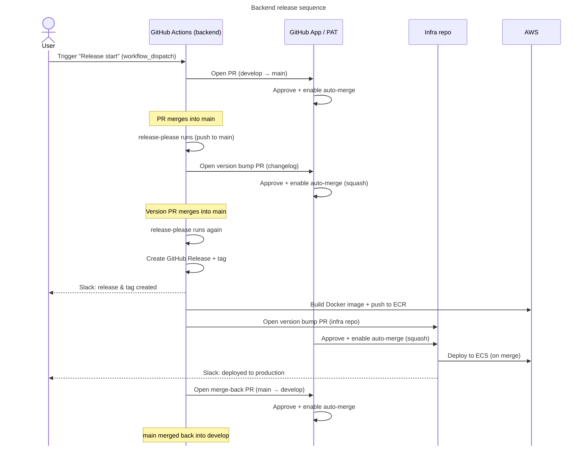
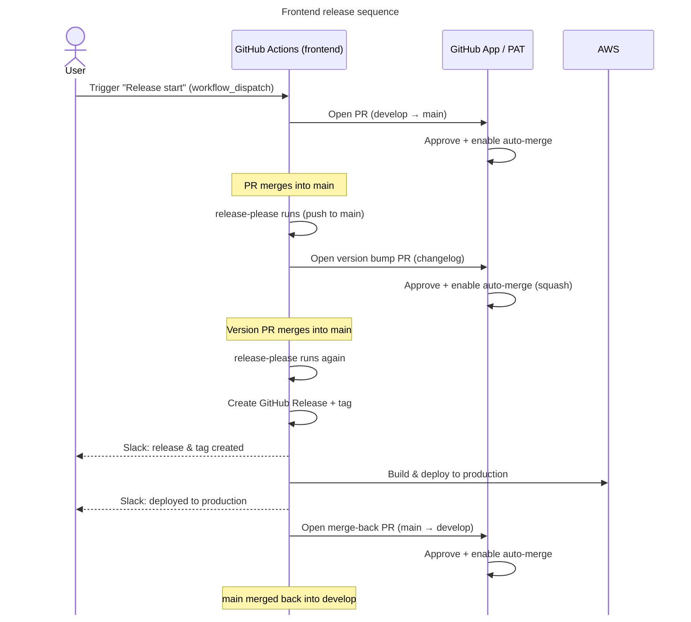
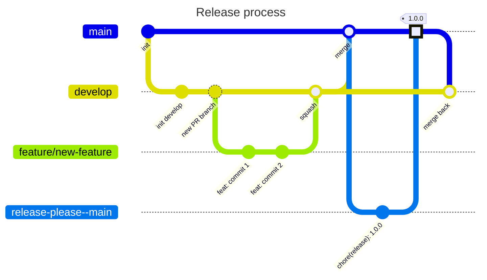
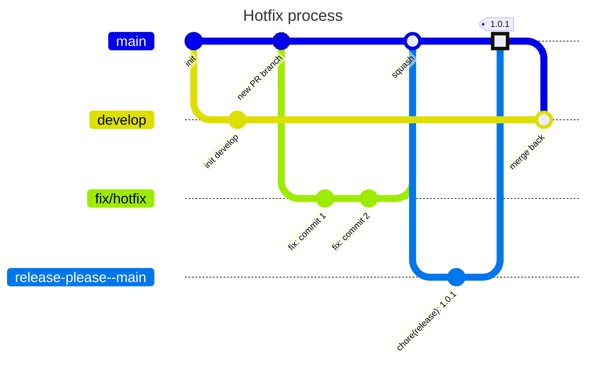

# Automated Release Workflow

This document explains how the automated release process works across our repositories. It applies to both **backend** and **frontend** applications, which share the same release automation but differ in how they deploy to production.

> ℹ️ All the workflows described here live in a central **[`syrocolab/workflows`](https://github.com/syrocolab/workflows)** repository as **reusable workflows** (`release-start.yml`, `release.yml`, `merge-back.yml`). Each application repository only contains thin caller workflows that reference them via `workflow_call`. This document describes that production setup; the repository you are reading it in is a simplified, self-contained replica used for testing (the reusable workflows are inlined and deploy steps are stubbed).

> ℹ️ Required CI status checks are omitted from the diagrams for clarity — in production they run on every pull request and must pass before auto-merge can complete.

---

## Key principle: one manual step, everything else automated

The only action a human performs is **starting the release**. Every subsequent step — opening pull requests, approving them, and merging them — is performed automatically by a **GitHub App** and a **Personal Access Token (PAT)**:

| Identity | Purpose |
| --- | --- |
| **GitHub App** (org-owned) | Opens pull requests and enables auto-merge. Runs as the app installation, so it can act across repositories (including the infra repo). |
| **PAT** (tied to an existing user) | Approves the pull requests (`review --approve`). A PAT is required because GitHub does not let a PR be approved by the same identity that opened it, and branch protection requires an approving review. |

In the diagrams below these two identities are grouped together as **`GitHub App / PAT`** to keep things readable — just remember the App *opens & merges* while the PAT *approves*.

### What the user does

The user triggers **only the first step** — getting the changes onto `main` — by running the **`Release start`** workflow from the GitHub Actions UI (`workflow_dispatch`), which opens the first `develop → main` pull request.

A release can also be started by opening a **fix pull request that targets `main` directly** (a hotfix). This relies on exactly the same downstream workflows: as soon as something lands on `main`, `release-please` takes over.

From that point on, the automation takes over.

---

## Backend release flow

The backend builds a Docker image, pushes it to ECR, and deploys through a **separate infrastructure repository** (which owns the Terragrunt/ECS configuration).

```mermaid
---
title: Backend release sequence
config:
  mirrorActors: false
---
sequenceDiagram
    actor User
    participant GHA as GitHub Actions (backend)
    participant Bot as GitHub App / PAT
    participant Infra as Infra repo
    participant AWS

    %% Start release (only manual step)
    User->>GHA: Trigger "Release start" (workflow_dispatch)
    GHA->>Bot: Open PR (develop → main)

    %% Auto-merge into main
    Bot->>Bot: Approve + enable auto-merge
    Note over GHA: PR merges into main

    %% Version bump PR (release-please)
    GHA->>GHA: release-please runs (push to main)
    GHA->>Bot: Open version bump PR (changelog)
    Bot->>Bot: Approve + enable auto-merge (squash)
    Note over GHA: Version PR merges into main

    %% Release + tag
    GHA->>GHA: release-please runs again
    GHA->>GHA: Create GitHub Release + tag
    GHA-->>User: Slack: release & tag created

    %% Build & deploy via infra
    GHA->>AWS: Build Docker image + push to ECR
    GHA->>Infra: Open version bump PR (infra repo)
    Bot->>Infra: Approve + enable auto-merge (squash)
    Infra->>AWS: Deploy to ECS (on merge)
    Infra-->>User: Slack: deployed to production

    %% Merge back
    GHA->>Bot: Open merge-back PR (main → develop)
    Bot->>Bot: Approve + enable auto-merge
    Note over GHA: main merged back into develop
```

---

## Frontend release flow

The frontend flow is **simpler**: there is **no infrastructure-repository step**. Once the release is published, the CI in the same repository builds and **deploys directly to production** (e.g. S3 / CDN), so the "deployed to production" Slack notification is sent from the same repository.

```mermaid
---
title: Frontend release sequence
config:
  mirrorActors: false
---
sequenceDiagram
    actor User
    participant GHA as GitHub Actions (frontend)
    participant Bot as GitHub App / PAT
    participant AWS

    %% Start release (only manual step)
    User->>GHA: Trigger "Release start" (workflow_dispatch)
    GHA->>Bot: Open PR (develop → main)

    %% Auto-merge into main
    Bot->>Bot: Approve + enable auto-merge
    Note over GHA: PR merges into main

    %% Version bump PR (release-please)
    GHA->>GHA: release-please runs (push to main)
    GHA->>Bot: Open version bump PR (changelog)
    Bot->>Bot: Approve + enable auto-merge (squash)
    Note over GHA: Version PR merges into main

    %% Release + tag
    GHA->>GHA: release-please runs again
    GHA->>GHA: Create GitHub Release + tag
    GHA-->>User: Slack: release & tag created

    %% Deploy directly (no infra repo)
    GHA->>AWS: Build & deploy to production
    GHA-->>User: Slack: deployed to production

    %% Merge back
    GHA->>Bot: Open merge-back PR (main → develop)
    Bot->>Bot: Approve + enable auto-merge
    Note over GHA: main merged back into develop
```

**Difference at a glance**

| Step | Backend | Frontend |
| --- | --- | --- |
| Build artifact | Docker image → ECR | Static build |
| Deploy target | Infra repo → ECS | Directly to production (S3 / CDN) |
| Infra PR | ✅ opened & auto-merged | ❌ none |
| "Deployed" Slack notification sent from | Infra repo | Same repo |

Everything **before** the deploy step (release start, version bump, release/tag, merge-back) is identical between backend and frontend.

---

## Git branching model

The topology of the branches and merges is the same regardless of who performs the actions. `develop` is the integration branch; `main` is the release branch; each release is cut on `main` by release-please and then merged back into `develop`.

### Standard release

```mermaid
---
title: Release process
---
gitGraph
commit id: "init"

branch "develop"
checkout "develop"
commit id: "init develop"

commit id: "new PR branch"

branch "feature/new-feature"
checkout "feature/new-feature"
commit id: "feat: commit 1"
commit id: "feat: commit 2"

checkout "develop"
merge "feature/new-feature" id: "squash"

checkout "main"
merge "develop" id: "merge"

branch "release-please--main"
checkout "release-please--main"
commit id: "chore(release): 1.0.0"

checkout "main"
merge "release-please--main" type: HIGHLIGHT tag: "1.0.0"

checkout "develop"
merge "main" id: "merge back"
```

### Hotfix

```mermaid
---
title: Hotfix process
---
gitGraph
commit id: "init"

branch "develop"
checkout "develop"
commit id: "init develop"

checkout "main"
commit id: "new PR branch"

branch "fix/hotfix"
checkout "fix/hotfix"
commit id: "fix: commit 1"
commit id: "fix: commit 2"

checkout "main"
merge "fix/hotfix" id: "squash"

branch "release-please--main"
checkout "release-please--main"
commit id: "chore(release): 1.0.1"

checkout "main"
merge "release-please--main" type: HIGHLIGHT tag: "1.0.1"

checkout "develop"
merge "main" id: "merge back"
```

---

## Step-by-step reference

> **How "auto-merge" actually works.** Nothing in these workflows force-merges a PR. Each step simply runs two CLI commands: `gh pr review --approve` (as the PAT) and `gh pr merge --auto --merge` (or `--auto --squash`, as the App). The `--auto` flag only *enables* GitHub's native auto-merge for the chosen method; GitHub then merges the PR on its own **once it is mergeable** — i.e. once the required approval is present and all required status checks (CI) have passed. If CI fails, the PR just stays open.

1. **Release start** *(user)* — a `develop → main` PR is opened by running the `Release start` workflow (`workflow_dispatch`). This is the **only manual step**. Opening a fix PR directly against `main` is the alternative (hotfix) entry point.
2. **Merge into `main`** *(automated)* — the PR from step 1 is approved (PAT) and has auto-merge enabled (App), then merges once CI passes.
3. **Version bump PR** *(automated)* — the push to `main` triggers `release-please`, which opens a `release-please--main` PR containing the changelog and version bump. It is approved and auto-merge (squash) is enabled. A Slack "release PR ready" notification is sent.
4. **Release & tag** *(automated)* — merging the version bump PR triggers `release-please` again, which creates the GitHub Release and Git tag. A Slack "release & tag created" notification with the changelog is sent.
5. **Deploy to production** *(automated)*
   - **Backend:** build the Docker image and push to ECR, then open a version-bump PR in the **infra repo** (approved, auto-merge/squash enabled). The infra repo then deploys to ECS and sends the "deployed to production" Slack notification.
   - **Frontend:** build and deploy directly to production from the same repo, then send the "deployed to production" Slack notification.
6. **Merge back** *(automated)* — a `main → develop` PR is opened with auto-merge enabled so `develop` stays in sync with the released code.

---

## Implementation notes

- **Reusable workflows.** The per-repository workflows (`Release start`, `Release`, `Deploy Production`) are thin callers that reference the shared reusable workflows in **[`syrocolab/workflows`](https://github.com/syrocolab/workflows)** (`release-start.yml`, `release.yml`, `merge-back.yml`) via `workflow_call`, with `secrets: inherit`. A repository onboards to the release process simply by adding those caller workflows.
- **Credentials.**
  - `RELEASE_PLEASE_APP_CLIENT_ID` (variable) + `RELEASE_PLEASE_APP_PRIVATE_KEY` (secret) → the **GitHub App**, used to open PRs and enable auto-merge.
  - `RELEASE_PLEASE_GITHUB_TOKEN` (secret) → the **PAT** (existing user) used only to approve PRs.
  - `SLACK_WEBHOOK_URL` (secret) → optional; Slack steps are skipped when it is not set.
- **Generating the App token.** The App credentials are exchanged for a short-lived installation token at runtime by [`actions/create-github-app-token`](https://github.com/marketplace/actions/create-github-app-token). By default the token is scoped to the repository running the workflow. To act on **another repository** — as the backend does when opening the infra PR — the action is given explicit `owner` and `repositories` inputs, which produces a token scoped to that target repo (the App must be installed there too). See the action's documentation for all available options.
- **release-please retry.** release-please runs through a composite action that retries up to 3 times with exponential backoff (15s, 30s) to absorb transient GitHub API failures.

---

## Slack notifications

The workflows post to Slack via the [`slackapi/slack-github-action`](https://github.com/slackapi/slack-github-action) action, using an **incoming webhook**. Payloads use Slack's **rich Block Kit formatting** (header and section blocks) rather than plain text, so releases render as tidy, readable messages.

Together, the notifications give a running **progress feed for every step** of the automated release, so anyone watching the channel can follow a release from start to finish without opening GitHub:

| When | Message |
| --- | --- |
| Version bump PR created | 🔗 "Release PR is ready" + link |
| Release & tag created | 📦 "Release and tag created" + **formatted changelog** |
| Merge-back PR created | 🔗 "Merge-back PR is ready" + link |
| Infra PR created *(backend only)* | 🔗 "Infra PR is ready" + link |
| Deployed to production | 🚀 "successfully deployed to production" |

### Changelog message

When the release and tag are created, the notification includes the full changelog. The workflow reformats release-please's Markdown into Slack `mrkdwn` (strips the version header, converts headings and bullets, removes commit/issue links) so it reads cleanly in the channel. This message is designed to be **copied and pasted into the `#release-announcements` channel** as the human-facing release note.

The quality of that changelog depends entirely on commit hygiene: **every PR should be squash-and-merged with a title that follows [Conventional Commits](https://www.conventionalcommits.org/)** (`feat: …`, `fix: …`, `chore: …`, …). release-please groups and renders the changelog from those squashed commit titles, so a clean, conventional title on each merged PR is what makes the announcement readable and correctly categorised.

The type prefix drives the grouping: the `feat` / `fix` keyword itself is dropped and the entry is filed under the matching section — `feat:` under **Features**, `fix:` under **Bug Fixes**, and so on. A title may also carry an optional **scope** in parentheses, `feat(scope): …`, which is kept and shown next to the entry to indicate the affected area. For example:

- `feat(auth): add SSO login` → listed under **Features** as *auth: add SSO login*
- `fix(api): handle empty payload` → listed under **Bug Fixes** as *api: handle empty payload*

---

## Setup guide

This section is a one-time setup checklist to enable the release process on a repository (and its infra repo, for backends). The GitHub App and PAT are configured **once at the organisation level** and shared by every repository; the Slack webhook, the auto-merge setting and the branch ruleset are configured **per repository**.

### 1. Create the GitHub App (organisation level)

1. Go to **Organisation → Settings → Developer settings → GitHub Apps → New GitHub App**.
2. Give it a name (e.g. `syroco-release-please`), set a homepage URL (any valid URL), and **uncheck "Active" under Webhook** (no webhook is needed).
3. Under **Permissions → Repository permissions**, grant:
   - **Contents:** Read and write — push branches/tags, create releases, let release-please commit.
   - **Pull requests:** Read and write — create PRs and enable auto-merge.
   - **Metadata:** Read-only (mandatory, selected automatically).
4. Under **"Where can this GitHub App be installed?"**, choose **Only on this account**.
5. Create the app, then note its **Client ID** (shown on the app's General page).

### 2. Generate the App private key

1. On the GitHub App's **General** page, scroll to **Private keys → Generate a private key**.
2. A `.pem` file downloads automatically — this is the value used for `RELEASE_PLEASE_APP_PRIVATE_KEY`. Store it securely; it cannot be retrieved again (only regenerated).

### 3. Install the App on the repositories

1. On the GitHub App page, open **Install App** and install it on the organisation.
2. Select the repositories it should access: **each application repository** (backend/frontend) **and the infra repository** (so the backend deploy workflow can open cross-repo PRs).
3. Re-run this step to add repositories as new services are onboarded.

### 4. Create the PAT (approver identity)

The PAT belongs to an **existing user** and is used only to approve PRs (a PR cannot be approved by the same identity that opened it, hence a second identity is required).

1. As that user, go to **Settings → Developer settings → Personal access tokens → Fine-grained tokens → Generate new token**.
2. Set the **Resource owner** to the organisation and grant access to the relevant repositories (application repos + infra repo).
3. Under **Repository permissions**, grant **Pull requests: Read and write** (and **Contents: Read-only**). This is enough to submit approving reviews.
4. Set a sensible expiry and add a calendar reminder to rotate it — an expired PAT silently breaks the auto-approval step.
5. Copy the generated token — this is the value for `RELEASE_PLEASE_GITHUB_TOKEN`.

> A classic PAT with the `repo` scope also works, but a fine-grained token scoped to just the needed repos and permissions is preferred.

### 5. Store the credentials

**Organisation level** — the App and PAT are shared by every repository, so configure them once under **Organisation → Settings → Secrets and variables → Actions**. Every caller workflow forwards them with `secrets: inherit`:

| Name | Type | Value |
| --- | --- | --- |
| `RELEASE_PLEASE_APP_CLIENT_ID` | **Variable** | GitHub App Client ID (step 1) |
| `RELEASE_PLEASE_APP_PRIVATE_KEY` | **Secret** | Contents of the `.pem` file (step 2) |
| `RELEASE_PLEASE_GITHUB_TOKEN` | **Secret** | The PAT (step 4) |

**Per repository** — the Slack webhook is set on **each repository** (**Settings → Secrets and variables → Actions**), because backend and frontend apps notify different channels:

| Name | Type | Value |
| --- | --- | --- |
| `SLACK_WEBHOOK_URL` | **Secret** | The app's incoming webhook URL (optional — Slack steps are skipped if unset) |

> The webhook URL comes from the Slack app's **Incoming Webhooks** configuration: <https://api.slack.com/apps/A0AU91Y0GTS/incoming-webhooks>. Each webhook is bound to a specific channel, so use the one for the target repository's channel.

### 6. Allow auto-merge on the repository

On **each repository → Settings → General → Pull Requests**, tick **"Allow auto-merge"**. Without this, the `gh pr merge --auto` calls fail and PRs are never merged. Keep "Allow squash merging" and "Allow merge commits" enabled as well (both merge methods are used).

### 7. Branch protection / ruleset for `develop` and `main`

Add a **ruleset** (or classic branch protection) targeting `main` and `develop`:

- **Require a pull request before merging** — with **at least 1 approving review**.
- **Require status checks to pass** — select the CI check(s).
- Keep **"Block force pushes"** enabled.

**No bypass actor is required.** Because the App opens each PR and the PAT (a *different* identity) submits a genuine approving review, the "require 1 approval" rule is satisfied normally and auto-merge can complete on its own. The two-identity split exists precisely so the process never needs to bypass the ruleset.

> Caveat: avoid rules that the automation cannot satisfy — e.g. **"Require review from Code Owners"** (unless the PAT user is the code owner) or **"Dismiss stale approvals on new commits"** combined with release-please amending the PR after approval.
